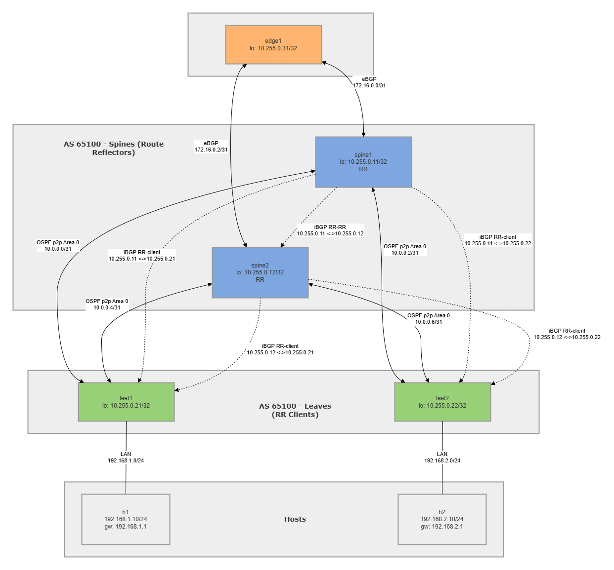

# mini-fabric-lab

A fully containerized, reproducible network fabric lab built with [Containerlab](https://containerlab.dev/) and [FRRouting](https://frrouting.org/).  
It models a two-tier spine-leaf fabric with an OSPF underlay, iBGP overlay using route reflectors, and an eBGP edge router that injects a default route and receives internal prefixes — all verified by a Python health-check that drives `vtysh` and parses JSON show outputs.

This project was built to demonstrate topology-as-code, configs-as-code, and verification-as-code end-to-end.

---

## Topology



```
                        ┌────────────────────────────────┐
                        │   edge1   (AS 65050)           │
                        │  lo 10.255.0.31                │
                        └──────┬──────────────┬──────────┘
                  eBGP         │              │         eBGP
             172.16.0.0/31     │              │    172.16.0.2/31
                               │              │
              ┌────────────────┘              └─────────────────┐
              │                                                  │
     ┌────────▼──────────┐                        ┌─────────────▼─────┐
     │  spine1 (RR)      │                        │  spine2 (RR)      │
     │  lo 10.255.0.11   │◄──── iBGP (RR mesh)───►│  lo 10.255.0.12   │
     │  AS 65100         │                        │  AS 65100         │
     └──┬───────────┬────┘                        └──┬──────────┬─────┘
        │           │                                │          │
10.0.0.0│           │10.0.0.2/31         10.0.0.4/31│          │10.0.0.6/31
  /31   │           │                               │          │
        │           └──────────────┬────────────────┘          │
        │                          │                            │
 ┌──────▼──────┐             ┌─────▼───────┐
 │  leaf1      │             │  leaf2      │
 │ lo 10.255.0.21│           │ lo 10.255.0.22│
 │  AS 65100   │             │  AS 65100   │
 └──────┬──────┘             └──────┬──────┘
        │ 192.168.1.0/24            │ 192.168.2.0/24
   ┌────▼────┐                 ┌────▼────┐
   │   h1    │                 │   h2    │
   │ .1.10   │                 │ .2.10   │
   └─────────┘                 └─────────┘
```

---

## Features

- **Topology-as-code** — single `topology.clab.yml` defines all 7 nodes and 8 links
- **Configs-as-code** — all FRR configs are version-controlled plain text; no manual CLI
- **OSPF underlay** — point-to-point links in area 0 distribute loopback reachability for iBGP peering
- **iBGP overlay with route reflectors** — spine1 and spine2 act as RRs; leaves are RR clients
- **Dual-homed eBGP edge** — edge1 (AS 65050) peers with both spines, originates a default route, receives fabric prefixes
- **next-hop-self** — spines rewrite the BGP next-hop on reflected routes so leaves always have a reachable next-hop
- **Inbound/outbound policy** — spines filter: accept only `0.0.0.0/0` from edge, advertise only leaf subnets to edge
- **Verification-as-code** — `healthcheck.py` checks container health, OSPF adjacencies, BGP peer states, route table entries, and cross-fabric ping; outputs a timestamped Markdown report

---

## How to Run

### Prerequisites

- Linux host (or WSL2) with Docker installed
- [Containerlab](https://containerlab.dev/install/) installed (`sudo bash -c "$(curl -sL https://get.containerlab.dev)"`)
- Python 3.10+ with `pyyaml` (`pip install -r requirements.txt`)

### Commands

```bash
# Bring up all containers and apply configs
make deploy

# Run the automated health-check and write a results/ report
make test

# Tear down and clean up all containers and links
make destroy

# Collect structured show-output evidence (optional)
make collect
```

---

## Documentation

| Document | Description |
|---|---|
| [docs/design-notes.md](docs/design-notes.md) | Full architecture rationale: addressing, OSPF, BGP, policy, automation, scaling considerations |
| [docs/troubleshooting-notes.md](docs/troubleshooting-notes.md) | Layered troubleshooting methodology, common failure patterns, command reference |
| [results/sample_healthcheck_report.md](results/sample_healthcheck_report.md) | Sample `healthcheck.py` output — all 35 checks passing |
| [results/sample_show_outputs/](results/sample_show_outputs/) | Realistic FRR show command outputs and end-to-end ping/traceroute evidence |

---

## Design Choices

### Why OSPF underlay + iBGP overlay?

OSPF is the simplest IGP for a small fabric — zero pre-configuration between neighbors on a point-to-point link, fast convergence, and it naturally distributes loopback `/32` addresses that iBGP needs as stable peer addresses. Using an IGP for underlay and BGP for overlay is the pattern used in production data-center fabrics (e.g., Clos designs), so it directly reflects real-world architecture.

### Why route reflectors?

In a full-mesh iBGP design, every router must peer with every other router — `n(n-1)/2` sessions. Route reflectors break that scaling problem: leaves only need sessions to the two spines. In this lab the saving is small, but the pattern scales identically to a 100-leaf fabric. Spines are the natural RR placement because they already have physical connectivity to every leaf.

### Why `next-hop-self` and what problem it solves

When spine1 (RR) reflects a route originally advertised by edge1 (172.16.0.1) to leaf1, the BGP next-hop is still `172.16.0.1` — an address leaf1 has no OSPF route to. `next-hop-self` on the spine rewrites that next-hop to the spine's own loopback (`10.255.0.11`), which leaf1 *does* have an OSPF route to. Without this, reflected routes are unreachable at the leaves.

### Basic policy at the edge

| Direction | Filter | Reason |
|---|---|---|
| Edge → Spine (in) | `DEFAULT-ONLY` — permit `0.0.0.0/0` only | Prevent edge from leaking arbitrary routes into the fabric |
| Spine → Edge (out) | `FABRIC-OUT` — permit `192.168.1.0/24`, `192.168.2.0/24` only | Advertise only real host subnets; no internal infrastructure prefixes |

edge1 uses `default-originate` (a static Null0 black-hole triggers the conditional) rather than a network statement, which is the production-safe way to originate a default.

---

## Validation Evidence

### OSPF neighbors (spine1)

```
spine1# show ip ospf neighbor

Neighbor ID     Pri State           Up Time         Dead Time Address         Interface                        RXmtL RqstL DBsmL
10.255.0.21       1 Full/-          1m23s             37.293s 10.0.0.1        eth1:10.0.0.0                        0     0     0
10.255.0.22       1 Full/-          1m21s             35.104s 10.0.0.3        eth2:10.0.0.2                        0     0     0
```

### BGP summary (spine1 — RR perspective)

```
spine1# show ip bgp summary

Neighbor        V         AS   MsgRcvd   MsgSent   TblVer  InQ OutQ  Up/Down State/PfxRcd   PfxSnt Desc
10.255.0.21     4      65100        42        44        0    0    0 00:18:32            1        3 N/A
10.255.0.22     4      65100        39        41        0    0    0 00:18:28            1        3 N/A
172.16.0.1      4      65050        35        37        0    0    0 00:17:55            1        2 N/A
```

### healthcheck.py report output

```
[PASS] spine1 container exists - clab-mini-fabric-lab-spine1 is running
[PASS] spine1 OSPF neighbor count - expected 2, got 2
[PASS] spine1 BGP peer 10.255.0.21 - expected Established, got Established
[PASS] spine1 BGP peer 10.255.0.22 - expected Established, got Established
[PASS] spine1 BGP peer 172.16.0.1 - expected Established, got Established
[PASS] spine1 route 192.168.1.0/24 - present in routing table
[PASS] spine1 route 192.168.2.0/24 - present in routing table
[PASS] spine1 route 0.0.0.0/0 - present in routing table
...
[PASS] h1 ping 192.168.2.10 - reachable
[PASS] h2 ping 192.168.1.10 - reachable

Report written to: results/healthcheck-20260408-142301.md
```

---

## Failure Demo

**Scenario: spine1–leaf1 link failure**

```bash
# Shut eth1 on spine1 (simulates physical link failure)
docker exec clab-mini-fabric-lab-spine1 ip link set eth1 down
```

**What broke:**
- OSPF adjacency between spine1 and leaf1 dropped immediately
- spine1 OSPF neighbor count fell from 2 → 1
- leaf1 lost its BGP session to spine1 (loopback unreachable via that path)
- Routes from leaf1 were temporarily withdrawn from spine1's table

**What was observed:**
```bash
make test
[FAIL] spine1 OSPF neighbor count - expected 2, got 1
[FAIL] spine1 BGP peer 10.255.0.21 - expected Established, got Active
```

**Recovery:**
- leaf1 still had its spine2 OSPF adjacency and spine2 BGP session intact — traffic continued via spine2 (dual-homed design worked as expected)
- Restoring the link: `docker exec clab-mini-fabric-lab-spine1 ip link set eth1 up`
- OSPF reconverged in ~10 s; BGP session re-established; `make test` returned all PASS

---

## What I Would Do Next

- **ECMP load-balancing** — enable `maximum-paths 2` in BGP on the leaves so traffic hashes across both spines instead of preferring one
- **BFD** — add Bidirectional Forwarding Detection on the fabric links to get sub-second failure detection instead of relying on OSPF dead-interval timers
- **Automated failure injection** — extend `healthcheck.py` with a `--chaos` mode that shuts a random link, runs checks, then restores and verifies recovery
- **CI integration** — add a GitHub Actions workflow that runs `make deploy && make test && make destroy` on a self-hosted runner with Docker, turning every commit into a full lab regression test
